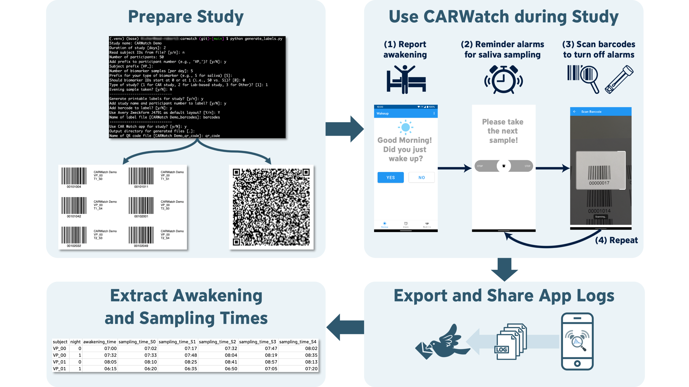

# Welcome to CARWatch!

CARWatch is an open-source framework for objective saliva sampling studies. It combines mobile apps for recording sample events with web-based tools for study preparation and log processing.

## Purpose

CARWatch aims to support objective and low-cost saliva sampling in real-world, unsupervised settings. It is intended to reduce reliance on self-reported timestamps alone and to support better protocol adherence in field studies.

## What CARWatch Includes

- mobile apps for reminder-based sampling support and barcode-based recording of sample events
- web-based tools for study configuration, barcode and QR-code generation, and log processing
- preparation of study materials for data collection
- structured output for downstream analysis

## Workflow

Researchers can use CARWatch to:

1. configure a study
2. generate barcodes and QR codes
3. distribute materials to participants
4. collect objective sampling timestamps through the mobile app
5. process exported log files after the study

## Further Information

- [Overview](/overview/)
- [Components](/components/)
- [Resources](/resources/)
- [Publications](/publications/)
- [Privacy policy](/privacy/)
